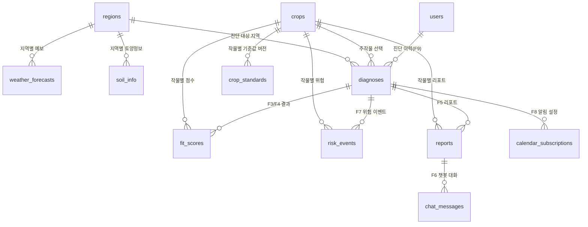

# 필드핏(FieldFit) DB 설계 문서

| 항목 | 내용 |
|---|---|
| 근거 문서 | `docs/필드핏_PRD.md`, `docs/필드핏_통합기획문서.md` (Ⅲ 기능명세서 · Ⅳ 정책서) |
| 적용 단계 | 예선 프로토타입(Next.js 앱)은 여전히 코드 내 mock 데이터만 사용 / DB 자체는 본선 대비 **Supabase에 미리 프로비저닝 완료** |
| 가정 기술 | PostgreSQL 계열(RDB) — Supabase(관리형 Postgres) |
| Supabase 프로젝트 | `fieldfit` (ref: `eqypntozsigbnjofetbn`, region: `ap-northeast-2`) — URL: `https://eqypntozsigbnjofetbn.supabase.co` |

> 이 문서는 PRD 5장(기능 요구사항)의 F1~F9와 통합기획문서 Ⅳ부(정책서) 18~23장의 기준값·정책을 저장 가능한 테이블 구조로 옮긴 것입니다. 예선 프로토타입은 이 스키마를 코드로 구현하지 않고 정적 mock 데이터로 대체하지만, 본선에서 실 데이터로 전환할 때 테이블 구조를 그대로 쓸 수 있도록 미리 맞춰둡니다.

---

## 1. 테이블 분류

| 분류 | 테이블 | 설명 | 갱신 주체 |
|---|---|---|---|
| 마스터/정책 데이터 | `regions`, `crops`, `crop_standards` | 지역 목록, 작물 목록, 작물별 표준 생육조건 기준값(18장) | 운영자가 시딩·정책 개정 시 수동 갱신 |
| 외부 데이터 캐시 | `weather_forecasts`, `soil_info` | 기상청 단기예보, 농경지 토양정보 캐시(21.1절 갱신 주기) | 배치/스케줄러가 자동 갱신 |
| 사용자 도메인 데이터 | `users`, `diagnoses`, `fit_scores`, `risk_events`, `calendar_subscriptions`, `reports`, `chat_messages` | 진단 요청·결과·리포트·챗봇 대화 (F1~F9) | 서비스 로직이 요청 시점에 생성 |

---

## 2. ER 다이어그램

---

## 3. 테이블 정의

### 3.1 `regions` — 지역 마스터
| 컬럼 | 타입 | 제약 | 설명 |
|---|---|---|---|
| id | uuid | PK | |
| code | varchar(50) | UNIQUE, NOT NULL | 예: `gochang` |
| name | varchar(100) | NOT NULL | 예: `전북 고창` |
| created_at | timestamptz | DEFAULT now() | |

### 3.2 `crops` — 작물 마스터
| 컬럼 | 타입 | 제약 | 설명 |
|---|---|---|---|
| id | varchar(20) | PK | `apple`\|`pear`\|`cucumber`\|`potato`\|`lettuce` (5종 고정, 18장) |
| name_ko | varchar(50) | NOT NULL | 예: `사과` |
| created_at | timestamptz | DEFAULT now() | |

### 3.3 `crop_standards` — 작물별 표준 생육조건 기준값 (18장)
| 컬럼 | 타입 | 제약 | 설명 |
|---|---|---|---|
| id | uuid | PK | |
| crop_id | varchar(20) | FK → crops.id, NOT NULL | |
| optimal_temp_min_c | numeric(4,1) | NOT NULL | 생육 적정온도 하한 |
| optimal_temp_max_c | numeric(4,1) | NOT NULL | 생육 적정온도 상한 |
| low_temp_risk_c | numeric(4,1) | NOT NULL | 저온 위험 기준 |
| high_temp_risk_c | numeric(4,1) | NOT NULL | 고온 위험 기준 |
| optimal_ph_min | numeric(3,1) | NOT NULL | 적정 토양 pH 하한 |
| optimal_ph_max | numeric(3,1) | NOT NULL | 적정 토양 pH 상한 |
| note | text | | 비고(18장 "비고" 컬럼) |
| source | varchar(200) | NOT NULL | 예: `농촌진흥청 표준영농교본(잠정치)` |
| version | int | NOT NULL DEFAULT 1 | 23장 "정책 변경 관리" — 기준값 개정 시 버전 증가 |
| effective_from | date | NOT NULL DEFAULT now() | 이 버전이 적용되기 시작한 날짜 |
| created_at | timestamptz | DEFAULT now() | |

- UNIQUE(`crop_id`, `version`)
- 조회 시 항상 `crop_id`별 최신 `version`(= `effective_from` 최댓값)만 사용

### 3.4 `weather_forecasts` — 기상청 단기예보 캐시 (21.1절: 3시간 단위 갱신)
| 컬럼 | 타입 | 제약 | 설명 |
|---|---|---|---|
| id | uuid | PK | |
| region_id | uuid | FK → regions.id, NOT NULL | |
| forecast_date | date | NOT NULL | 예보 대상 일자 |
| min_temp_c | numeric(4,1) | NOT NULL | |
| max_temp_c | numeric(4,1) | NOT NULL | |
| source | varchar(20) | NOT NULL | `kma` \| `mock` |
| fetched_at | timestamptz | NOT NULL | 기상청 발표 시각 기준 (20.4절 결측 판단에 사용) |

- UNIQUE(`region_id`, `forecast_date`, `source`)
- INDEX(`region_id`, `forecast_date`)

### 3.5 `soil_info` — 농경지 토양정보(농경지화학성 통계) 캐시 (21.1절: 연 1회 갱신)
| 컬럼 | 타입 | 제약 | 설명 |
|---|---|---|---|
| id | uuid | PK | |
| region_id | uuid | FK → regions.id, NOT NULL | |
| ph | numeric(3,1) | NOT NULL | |
| survey_year | int | NOT NULL | 조사연도 (화면에 명시, 20.4/21.1절) |
| source | varchar(20) | NOT NULL | `soil-info` \| `mock` |
| fetched_at | timestamptz | NOT NULL | |

- UNIQUE(`region_id`, `survey_year`)
- 조회 시 `region_id`별 최신 `survey_year` 사용, 없으면 21.2절 정책대로 인접 지역 평균값 대체(애플리케이션 로직)

### 3.6 `users` — 사용자 (본선 이후, 예선은 비로그인)
| 컬럼 | 타입 | 제약 | 설명 |
|---|---|---|---|
| id | uuid | PK | |
| anonymous_session_id | varchar(100) | UNIQUE, NULLABLE | 비로그인 사용자 세션 추적 (예선~본선 초기) |
| email | varchar(200) | UNIQUE, NULLABLE | 실서비스 로그인 도입 시 사용 (21.2절: 별도 동의 절차 필요) |
| created_at | timestamptz | DEFAULT now() | |

### 3.7 `diagnoses` — 진단 요청 (F1 입력값, F9 이력의 기본 단위)
| 컬럼 | 타입 | 제약 | 설명 |
|---|---|---|---|
| id | uuid | PK | |
| user_id | uuid | FK → users.id, NULLABLE | 비로그인 진단 허용 |
| region_id | uuid | FK → regions.id, NOT NULL | |
| crop_id | varchar(20) | FK → crops.id, NULLABLE | 온보딩에서 특정 작물 선택 시. "전체 비교(F4)"만 요청한 경우 NULL |
| period | varchar(7) | NOT NULL | `2026-03` 형식 |
| created_at | timestamptz | DEFAULT now() | |

- INDEX(`user_id`, `created_at` DESC) — F9 마이페이지 이력 목록 조회용
- INDEX(`region_id`, `period`)

### 3.8 `fit_scores` — 환경 적합도 산출 결과 (F3/F4, 19장 공식의 계산 결과 저장)
| 컬럼 | 타입 | 제약 | 설명 |
|---|---|---|---|
| id | uuid | PK | |
| diagnosis_id | uuid | FK → diagnoses.id, NOT NULL | |
| crop_id | varchar(20) | FK → crops.id, NOT NULL | F4는 5작물 각각 1행씩 생성 |
| score | int | NOT NULL, CHECK 0~100 | 종합 적합도 |
| grade | varchar(10) | NOT NULL | `매우적합`\|`적합`\|`보통`\|`주의`\|`부적합` (19.3절) |
| temperature_score | int | NOT NULL, CHECK 0~100 | |
| soil_ph_score | int | NOT NULL, CHECK 0~100 | |
| created_at | timestamptz | DEFAULT now() | |

- UNIQUE(`diagnosis_id`, `crop_id`)

### 3.9 `risk_events` — 위험 경고 (F7, 20.1절 트리거 조건의 결과 저장)
| 컬럼 | 타입 | 제약 | 설명 |
|---|---|---|---|
| id | uuid | PK | |
| diagnosis_id | uuid | FK → diagnoses.id, NOT NULL | |
| crop_id | varchar(20) | FK → crops.id, NOT NULL | |
| risk_type | varchar(20) | NOT NULL | `저온`\|`고온`\|`토양 병해` |
| risk_level | varchar(10) | NOT NULL | `주의`\|`경고` |
| event_date | date | NULLABLE | 토양 병해처럼 특정 날짜가 없는 위험은 NULL |
| description | text | NOT NULL | 근거 1줄 (20.2절 이벤트 설명) |
| created_at | timestamptz | DEFAULT now() | |

- INDEX(`diagnosis_id`, `event_date`) — .ics 생성 시 날짜순 조회
- .ics 파일 생성 시 같은 `event_date`에 여러 행이 있으면 애플리케이션 레벨에서 하나의 캘린더 이벤트로 병합(20.2절)

### 3.10 `calendar_subscriptions` — 알림 수신 시점 설정 (F8, 20.3절)
| 컬럼 | 타입 | 제약 | 설명 |
|---|---|---|---|
| id | uuid | PK | |
| diagnosis_id | uuid | FK → diagnoses.id, NOT NULL | |
| alarm_offset_days | int | NOT NULL, CHECK IN (0,1,3,7) | 당일(0)/1일 전/3일 전/7일 전 |
| notify_channel | varchar(20) | NOT NULL DEFAULT 'ics_only' | 예선: `ics_only`, 본선 확장: `email`\|`push` 추가 |
| created_at | timestamptz | DEFAULT now() | |

### 3.11 `reports` — LLM 재배 가이드 리포트 (F5, 22.1절)
| 컬럼 | 타입 | 제약 | 설명 |
|---|---|---|---|
| id | uuid | PK | |
| diagnosis_id | uuid | FK → diagnoses.id, NOT NULL | |
| crop_id | varchar(20) | FK → crops.id, NOT NULL | |
| summary | text | NOT NULL | ① 종합 진단 요약 |
| soil_climate_explainer | text | NOT NULL | ② 토양·기후 설명(쉬운 말) |
| seasonal_guide | text | NOT NULL | ③ 시기별 재배 가이드 |
| risk_guidance | text | NOT NULL | ④ 리스크와 대응법 |
| disclaimer | text | NOT NULL | 22.3절 면책 조항 문구 |
| model | varchar(50) | NULLABLE | 본선: 사용된 LLM 모델명 (예: `claude-sonnet-5`) |
| created_at | timestamptz | DEFAULT now() | |

- UNIQUE(`diagnosis_id`, `crop_id`)

### 3.12 `chat_messages` — 컨텍스트 챗봇 대화 로그 (F6, 22.2절)
| 컬럼 | 타입 | 제약 | 설명 |
|---|---|---|---|
| id | uuid | PK | |
| report_id | uuid | FK → reports.id, NOT NULL | 챗봇은 리포트 하나를 컨텍스트로 근거 삼음 |
| role | varchar(10) | NOT NULL | `user`\|`assistant` |
| content | text | NOT NULL | |
| source_section | varchar(50) | NULLABLE | 근거가 된 리포트 섹션 태그 (assistant 메시지만 해당) |
| created_at | timestamptz | DEFAULT now() | |

- INDEX(`report_id`, `created_at`) — 대화 순서 조회

---

## 4. 데이터 갱신·보존 정책 매핑

| 정책(통합기획문서 근거) | DB 반영 |
|---|---|
| 21.1절 기상청 단기예보 3시간 갱신 | `weather_forecasts.fetched_at` 기준 3시간 경과 시 배치가 새 행 upsert |
| 21.1절 토양정보 연 1회 갱신 | `soil_info`는 `survey_year`가 바뀔 때만 새 행 추가, 과거 연도 행은 이력으로 보존 |
| 18장/23장 기준값 잠정치 → 확정치 교체 | `crop_standards`에 새 `version` 행 추가(기존 행 삭제 금지) → 과거 진단 결과의 근거 추적 가능 |
| 20.4절 데이터 결측 시 대체 | `soil_info`/`weather_forecasts`에 해당 지역 최신 행이 없으면 애플리케이션이 인접 지역 평균값 계산 후 `source`에 `estimated` 태그 추가(스키마 확장 여지로 남겨둠) |
| 21.2절 개인정보 최소 수집 | `users`는 익명 세션까지만 필수, `email`은 로그인 도입 시점에만 채워짐 |

---

## 5. 단계별 적용 범위

| 단계 | 적용 테이블 | 비고 |
|---|---|---|
| 예선 | 없음 (Next.js 앱은 전부 코드 내 정적 mock 데이터 사용) | Supabase DB 자체는 아래처럼 미리 구축해둠 |
| 현재(본선 대비 사전 구축) | 전체 12개 테이블 스키마 생성 완료 + `crops`·`crop_standards`(18장 기준값) 시딩 완료 | `regions` 등 나머지는 본선 실데이터 연동 시점에 채움 |
| 본선 1차 | `regions`, `weather_forecasts`, `soil_info` 실데이터 적재 | 최소 1개 작물·1개 지역 실데이터 검증(PRD 4장) |
| 본선 2차 | `users`, `diagnoses`, `fit_scores`, `risk_events`, `calendar_subscriptions` 실사용 | F1~F4, F7~F8 실데이터 파이프라인 완성 |
| 이후 확장 | `reports`, `chat_messages` 실사용 | Claude API 연동 시점에 맞춰 도입 |

---

## 6. 접근 제어 (Row Level Security)

Supabase는 anon/authenticated 키로 `public` 스키마 테이블에 직접 접근하는 구조라, 테이블 생성 직후 RLS를 켜지 않으면 anon key만으로 전체 테이블을 읽고 쓸 수 있다. 아직 인증(로그인) 로직이 없는 단계이므로, 데이터 성격에 따라 아래처럼 나눠 적용했다.

| 그룹 | 테이블 | RLS 정책 |
|---|---|---|
| 참고/캐시 데이터 | `regions`, `crops`, `crop_standards`, `weather_forecasts`, `soil_info` | RLS 활성화 + `select` 정책(`using (true)`)으로 anon/authenticated 읽기 허용. 민감정보가 아니고 클라이언트가 직접 읽어도 되는 데이터 |
| 사용자 도메인 데이터 | `users`, `diagnoses`, `fit_scores`, `risk_events`, `calendar_subscriptions`, `reports`, `chat_messages` | RLS 활성화만 하고 정책은 추가하지 않음 → anon/authenticated는 완전 차단, **service_role 키로 서버(Next.js API Route/서버 액션)에서만 접근 가능** |

- 본선에서 로그인을 붙일 때는 사용자 도메인 테이블에 `auth.uid() = user_id` 기준의 select/insert/update 정책을 추가해야 한다(현재는 서버 경유만 허용되는 잠금 상태).
- 이 결정은 코드가 없는 지금 시점에 미리 잠가둔 것으로, 이후 실제 API 연동 코드를 작성할 때 정책을 다시 검토해야 한다.

---

## 7. 참고
- `docs/필드핏_PRD.md` — 기능 요구사항(F1~F9), 범위 정의
- `docs/필드핏_통합기획문서.md` 18~23장 — 기준값·산출 공식·위험/알림/데이터/LLM 정책 원문
